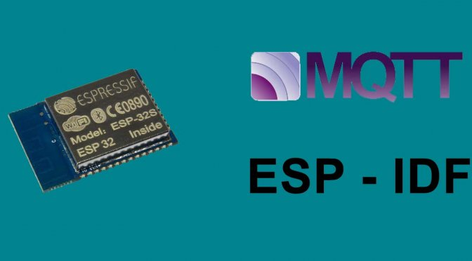

# MQTT Temperature Monitoring with ESP32 and MCP9808 (ESP-IDF Framework)

## Overview

This project demonstrates how to interface the **MCP9808 temperature** sensor with an ESP32 using the **ESP-IDF framework.** The ESP32 reads temperature data over **I2C** and sends it to a **Node.js MQTT subscriber** via an **MQTT broker (EMQX).**

## Table of Contents

- [Project Structure](#project-structure)
- [Hardware Components](#hardware-components)
- [Circuit Diagram](#circuit-diagram)
- [Setup Instructions](#setup-instructions)
   - [On the ESP32](#on-the-esp32)
   - [On the EMQX MQTT Broker](#on-the-emqx-mqtt-broker)
   - [On the Node.js MQTT Client](#on-the-node.js-mqtt-client)
- [How It Works](#how-it-works)
   - [ESP32 Workflow](#esp32-workflow)
   - [Node.js MQTT Subscriber Workflow](#nodejs-mqtt-subscriber-workflow)
- [Troubleshooting](#troubleshooting)
- [Author](#author)

## Project Structure
- **Microcontroller:** ESP32
- **Sensor:** MCP9808 (Precision temperature sensor)
- **Communication Protocols:**
     - I2C for ESP32-MCP9808 communication
     - MQTT for data transfer to Node.js
- **Broker:** EMQX MQTT broker
- **Subscriber:** Node.js MQTT client to receive and log temperature data

## Hardware Components

1. **ESP32 development board**
2. **MCP9808 temperature sensor**
3. **Breadboard and jumper wires**
4. **USB cable** for ESP32-PC connection

## Circuit Diagram
### Pin Connections

- **MCP9808 VCC → ESP32 3.3V**
- **MCP9808 GND → ESP32 GND**
- **MCP9808 SDA → ESP32 SDA (GPIO 21)**
- **MCP9808 SCL → ESP32 SCL (GPIO 22)**

## Setup Instructions
### On the ESP32
1. **Install PlatformIO:**
   - Install PlatformIO extension in Visual Studio Code.
2. **Configure PlatformIO for ESP-IDF:**
   - Set up the ESP-IDF framework in platformio.ini.
3. **Install Required Libraries:**
     - Use the ESP-IDF I2C driver for I2C communication.
     - Use the ESP-IDF MQTT client for sending temperature data to the broker.
4. **I2C Configuration:**
    - Initialize I2C with GPIO pins configured for SDA and SCL.
    - Set the MCP9808's I2C address (default: 0x18).
5. **MQTT Configuration:**
     - Set the MQTT broker address (e.g., broker.emqx.io), port (1883), and topic in the code.
6. **Data Flow Logic:**
      - Initialize the MCP9808 sensor and configure it to read temperature data.
      - Read the temperature in Celsius and format it as JSON.
      - Send the formatted data to the MQTT broker.

###  On the EMQX MQTT Broker
1. **Run EMQX Broker:***
    - Set up the EMQX broker locally using Docker or use a public EMQX broker (e.g., broker.emqx.io).
2. **Ensure Connectivity:**
    - Verify that the broker is accessible and listening on the MQTT port (1883).

### On the Node.js MQTT Client
1. **Install Node.js:**
    - Install Node.js and the mqtt package using npm install mqtt.
2. **Script Workflow:**
    - Connect to the EMQX MQTT broker.
     - Subscribe to the topic where the ESP32 is publishing temperature data.
    - Log received temperature readings to the console.

## How It Works
### ESP32 Workflow
1. **Initialization:**
     - The ESP32 initializes the I2C driver and configures the MCP9808.
     - WiFi and MQTT connections are established.
2. **Temperature Reading:**
    - The MCP9808 sensor provides high-accuracy temperature data over I2C.
    - Data is read periodically and converted into Celsius.
3. **Data Transmission:**
    - The ESP32 formats the temperature data as a JSON string.
    - This data is sent to the configured MQTT topic on the EMQX broker.

### Node.js MQTT Subscriber Workflow
1. **Subscription:**
    - The Node.js client connects to the MQTT broker and subscribes to the topic.
2. Data Logging:
     - Incoming temperature readings are logged in real-time.

##  Troubleshooting
1. **Sensor Not Responding:**
    - Verify I2C connections and address (0x18 default).
    - Ensure the MCP9808 is powered properly (3.3V).
2. **No Data on MQTT Topic:**
     - Check WiFi and MQTT broker connection.
     - Verify that the MQTT topic matches between the ESP32 and Node.js script.

## Author 
Sakshi Mishra